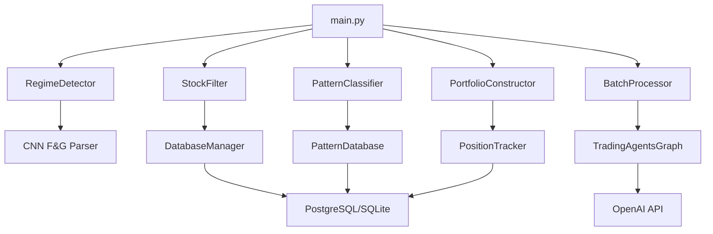

# KHAZAD_DUM Development Guide

> **⚙️ Development workflows, debugging, and contributing to the trading system**

## 🎯 Development Environment Setup

### Option 1: Hybrid Development (Recommended)
Use containerized infrastructure with local Python development:

```bash
# Start infrastructure only
docker-compose up -d database redis

# Develop with local Python  
python main.py                    # Run main trading pipeline
python khazad_monitor/cyberpunk_monitor.py  # Local monitoring

# Benefits: Easy debugging + Production-like infrastructure
```

### Option 2: Full Local Development  
Use SQLite for rapid development:

```bash
# Use SQLite (no containers needed)
export DATABASE_TYPE=sqlite
python main.py

# SQLite file: config/data/databases/khazad_dum.db
```

### Option 3: Full Containerization
Everything in containers (closest to production):

```bash
# Start everything
docker-compose up -d

# Develop inside containers
docker exec -it khazad-trading-engine bash
```

---

## 🏗️ Project Architecture (Developer View)

### Core Pipeline Flow
```python
# 1. Market Regime Detection  
from src.core.market_analysis.regime_detector import RegimeDetector
regime = RegimeDetector().get_current_regime()

# 2. Stock Screening
from src.core.stock_screening.stock_filter import StockFilter  
candidates = StockFilter().apply_regime_filters(regime)

# 3. AI Analysis
from src.trading_engines.tradingagents_integration.batch_processor import BatchProcessor
analysis = BatchProcessor().process_batch(candidates)

# 4. Pattern Recognition
from src.core.pattern_recognition.pattern_classifier import PatternClassifier
patterns = PatternClassifier().classify_batch(analysis)

# 5. Portfolio Construction
from src.core.portfolio_management.portfolio_constructor import PortfolioConstructor
positions = PortfolioConstructor().build_portfolio(patterns, regime)
```

### Key Components & Dependencies



---

## 🔧 Development Workflows

### Adding New Market Indicators

1. **Create indicator module:**
```python
# src/core/market_analysis/indicators/custom_indicator.py
class CustomIndicator:
    def __init__(self, config):
        self.config = config
    
    def calculate(self, market_data):
        """Calculate your custom indicator"""
        pass
```

2. **Integrate with regime detector:**
```python
# src/core/market_analysis/regime_detector.py
from .indicators.custom_indicator import CustomIndicator

class RegimeDetector:
    def __init__(self):
        self.custom_indicator = CustomIndicator(config)
    
    def detect_regime(self):
        # Use custom indicator in regime calculation
        custom_signal = self.custom_indicator.calculate(market_data)
```

3. **Add configuration:**
```python
# config/settings/base_config.py
CUSTOM_INDICATOR_CONFIG = {
    'enabled': True,
    'weight': 0.2,
    'threshold': 50
}
```

4. **Write tests:**
```python
# tests/unit/test_custom_indicator.py
def test_custom_indicator():
    indicator = CustomIndicator(test_config)
    result = indicator.calculate(sample_data)
    assert result is not None
```

### Adding New Stock Filters

1. **Extend StockFilter class:**
```python
# src/core/stock_screening/stock_filter.py
def apply_custom_filter(self, stocks, regime):
    """Add your custom filtering logic"""
    filtered = []
    for stock in stocks:
        if self._meets_custom_criteria(stock, regime):
            filtered.append(stock)
    return filtered

def _meets_custom_criteria(self, stock, regime):
    """Define your custom criteria"""
    return True  # Your logic here
```

2. **Add to filtering pipeline:**
```python
def apply_all_filters(self, stocks, regime):
    stocks = self.apply_volume_filter(stocks)
    stocks = self.apply_market_cap_filter(stocks)  
    stocks = self.apply_custom_filter(stocks, regime)  # Add here
    return stocks
```

### Adding New Pattern Types

1. **Define pattern in classifier:**
```python
# src/core/pattern_recognition/pattern_classifier.py
def classify_custom_pattern(self, metrics):
    """Identify your custom pattern"""
    if (metrics['rsi'] < 30 and 
        metrics['volume_ratio'] > 2.0 and
        metrics['price_change'] < -0.05):
        return {
            'type': 'custom_oversold_spike',
            'confidence': 0.85,
            'expected_duration': 3,
            'target_return': 0.08
        }
    return None
```

2. **Add to pattern types:**
```python
# config/settings/base_config.py
PATTERN_TYPES = {
    'custom_oversold_spike': {
        'min_confidence': 0.7,
        'position_multiplier': 1.2,
        'stop_loss': 0.06,
        'take_profit': 0.12
    }
}
```

### Extending TradingAgents Integration

1. **Create custom analysis prompts:**
```python
# src/trading_engines/tradingagents_integration/custom_prompts.py
CUSTOM_ANALYSIS_PROMPT = """
Analyze {symbol} with focus on:
1. Custom metric analysis
2. Sector-specific factors  
3. Your specific requirements

Market Data: {market_data}
Custom Context: {custom_context}
"""
```

2. **Extend batch processor:**
```python
# src/trading_engines/tradingagents_integration/batch_processor.py
def process_with_custom_context(self, symbol, custom_data):
    """Process with additional custom context"""
    enhanced_context = self._build_custom_context(symbol, custom_data)
    return self.trading_graph.propagate(symbol, enhanced_context)
```

---

## 🧪 Testing & Debugging

### Running Tests

```bash
# Run all tests
python -m pytest tests/ -v

# Run specific test categories
python -m pytest tests/unit/ -v                    # Unit tests
python -m pytest tests/integration/ -v             # Integration tests  
python -m pytest tests/integration/test_without_ibkr.py -v  # No broker needed

# Run tests with coverage
python -m pytest tests/ --cov=src --cov-report=html

# Run specific test file
python -m pytest tests/unit/test_regime_detector.py -v

# Run with debugging (drops into PDB on failure)
python -m pytest tests/unit/test_pattern_classifier.py --pdb
```

### Debug Individual Components

```bash
# Test regime detection
python -c "
from src.core.market_analysis.regime_detector import RegimeDetector
detector = RegimeDetector()
regime = detector.get_current_regime()
print(f'Current regime: {regime}')
"

# Test stock filtering  
python -c "
from src.core.stock_screening.stock_filter import StockFilter
filter_engine = StockFilter()
candidates = filter_engine.get_filtered_candidates('neutral')
print(f'Found {len(candidates)} candidates')
"

# Test TradingAgents
cd tradingagents_lib && python -c "
from tradingagents.graph.trading_graph import TradingAgentsGraph
from tradingagents.default_config import DEFAULT_CONFIG
ta = TradingAgentsGraph(debug=True, config=DEFAULT_CONFIG)
_, decision = ta.propagate('AAPL', '2024-05-10')
print(decision)
"

# Test database operations
python -c "
from src.data_pipeline.storage.database_manager import DatabaseManager
db = DatabaseManager()
print(f'Database health: {db.health_check()}')
"
```

### Interactive Development

```python
# Start IPython with project context
ipython

# In IPython:
%load_ext autoreload
%autoreload 2

from src.core.market_analysis.regime_detector import RegimeDetector
from src.core.stock_screening.stock_filter import StockFilter  
from src.data_pipeline.storage.database_manager import DatabaseManager

# Now you can interactively test components
detector = RegimeDetector()
regime = detector.get_current_regime()
```

---

## 🔍 Debugging Common Issues

### Database Connection Problems

```python
# Debug database connection
from src.data_pipeline.storage.database_manager import DatabaseManager
import traceback

try:
    db = DatabaseManager()
    result = db.execute_query("SELECT 1 as test")
    print(f"✓ Database connection working: {result}")
except Exception as e:
    print(f"❌ Database error: {e}")
    traceback.print_exc()
```

### API Integration Issues

```python
# Debug OpenAI API
import openai
from config.settings.base_config import OPENAI_API_KEY

try:
    openai.api_key = OPENAI_API_KEY
    response = openai.models.list()
    print(f"✓ OpenAI API working: {len(response.data)} models available")
except Exception as e:
    print(f"❌ OpenAI API error: {e}")

# Debug Finnhub API  
import requests
from config.settings.base_config import FINNHUB_API_KEY

try:
    url = f"https://finnhub.io/api/v1/quote?symbol=AAPL&token={FINNHUB_API_KEY}"
    response = requests.get(url)
    data = response.json()
    print(f"✓ Finnhub API working: AAPL price = ${data.get('c', 'N/A')}")
except Exception as e:
    print(f"❌ Finnhub API error: {e}")
```

### TradingAgents Debugging

```python
# Enable verbose TradingAgents logging
from tradingagents.graph.trading_graph import TradingAgentsGraph
from tradingagents.default_config import DEFAULT_CONFIG
import logging

# Set debug logging
logging.basicConfig(level=logging.DEBUG)

# Create debug-enabled graph
config = DEFAULT_CONFIG.copy()
config['debug'] = True
config['verbose'] = True

ta = TradingAgentsGraph(debug=True, config=config)
_, decision = ta.propagate('AAPL', '2024-05-10')
```

### Performance Profiling

```python
# Profile slow components
import cProfile
import pstats
from src.core.stock_screening.stock_filter import StockFilter

# Profile stock filtering
pr = cProfile.Profile()
pr.enable()

filter_engine = StockFilter()
candidates = filter_engine.get_filtered_candidates('neutral')

pr.disable()
stats = pstats.Stats(pr)
stats.sort_stats('cumulative').print_stats(10)
```

---

## 📊 Monitoring & Observability

### Development Monitoring

```bash
# Simple monitoring (development)
python khazad_monitor/simple_monitor.py

# Cyberpunk monitoring (production-like)  
python khazad_monitor/cyberpunk_monitor.py

# Test monitoring components
python khazad_monitor/test_monitor.py
python khazad_monitor/test_charts.py
```

### Performance Metrics

```python
# Add custom performance tracking
import time
from functools import wraps

def track_performance(func):
    @wraps(func)
    def wrapper(*args, **kwargs):
        start_time = time.time()
        result = func(*args, **kwargs)
        duration = time.time() - start_time
        print(f"{func.__name__} took {duration:.2f} seconds")
        return result
    return wrapper

# Use decorator
@track_performance
def my_slow_function():
    # Your code here
    pass
```

### Logging & Debugging

```python
# Enhanced logging for development
import logging
from config.settings.base_config import LOG_LEVEL

logging.basicConfig(
    level=getattr(logging, LOG_LEVEL, logging.INFO),
    format='%(asctime)s - %(name)s - %(levelname)s - %(message)s',
    handlers=[
        logging.FileHandler('logs/development.log'),
        logging.StreamHandler()
    ]
)

logger = logging.getLogger(__name__)

# Use in your components
logger.debug("Detailed debug information")
logger.info("General information")
logger.warning("Warning message")
logger.error("Error occurred")
```

---

## 🔄 Development Best Practices

### Code Organization
```
src/
├── core/                 # Business logic (no external dependencies)
├── data_pipeline/        # Data fetching & storage  
├── trading_engines/      # Trading execution & AI
└── integrations/         # External service integrations

tests/
├── unit/                 # Fast, isolated tests
├── integration/          # Component interaction tests
└── fixtures/             # Test data & mocks
```

### Configuration Management
```python
# Use environment-specific configs
from config.settings.base_config import *

if ENVIRONMENT == 'development':
    DATABASE_URL = SQLITE_DATABASE_URL
    DEBUG = True
    
elif ENVIRONMENT == 'production':
    DATABASE_URL = POSTGRESQL_DATABASE_URL  
    DEBUG = False
```

### Error Handling
```python
# Robust error handling with fallbacks
from src.data_pipeline.storage.database_manager import DatabaseManager
import logging

logger = logging.getLogger(__name__)

def safe_database_operation():
    try:
        db = DatabaseManager()
        return db.fetch_stock_metrics(['AAPL'])
    except Exception as e:
        logger.error(f"Database operation failed: {e}")
        # Fallback to cached data or mock data
        return get_cached_data()
```

### Testing Patterns
```python
# Use dependency injection for testability
class StockFilter:
    def __init__(self, database_manager=None):
        self.db = database_manager or DatabaseManager()
    
    def get_candidates(self):
        return self.db.fetch_stock_data()

# In tests
def test_stock_filter():
    mock_db = MockDatabaseManager()
    filter_engine = StockFilter(database_manager=mock_db)
    candidates = filter_engine.get_candidates()
    assert len(candidates) > 0
```

---

## 📚 Development Resources

### Key Files to Understand
1. `config/settings/base_config.py` - All system configuration
2. `src/data_pipeline/storage/database_manager.py` - Data persistence
3. `main.py` - Main execution flow
4. `tradingagents_lib/` - AI analysis framework

### Useful Development Commands
```bash
# Code formatting
black src/ tests/
isort src/ tests/

# Code quality  
flake8 src/
pylint src/

# Type checking
mypy src/

# Documentation generation
sphinx-build -b html docs/ docs/_build/
```

### Development Environment Variables
```bash
# .env for development
ENVIRONMENT=development
DEBUG=True
LOG_LEVEL=DEBUG
DATABASE_URL=sqlite:///config/data/databases/khazad_dum.db

# Test database (separate from dev)
TEST_DATABASE_URL=sqlite:///tests/test_khazad_dum.db
```

---

*🚀 **Happy developing!** The KHAZAD_DUM system is designed to be modular and extensible. Start small, test thoroughly, and gradually build up your features.*